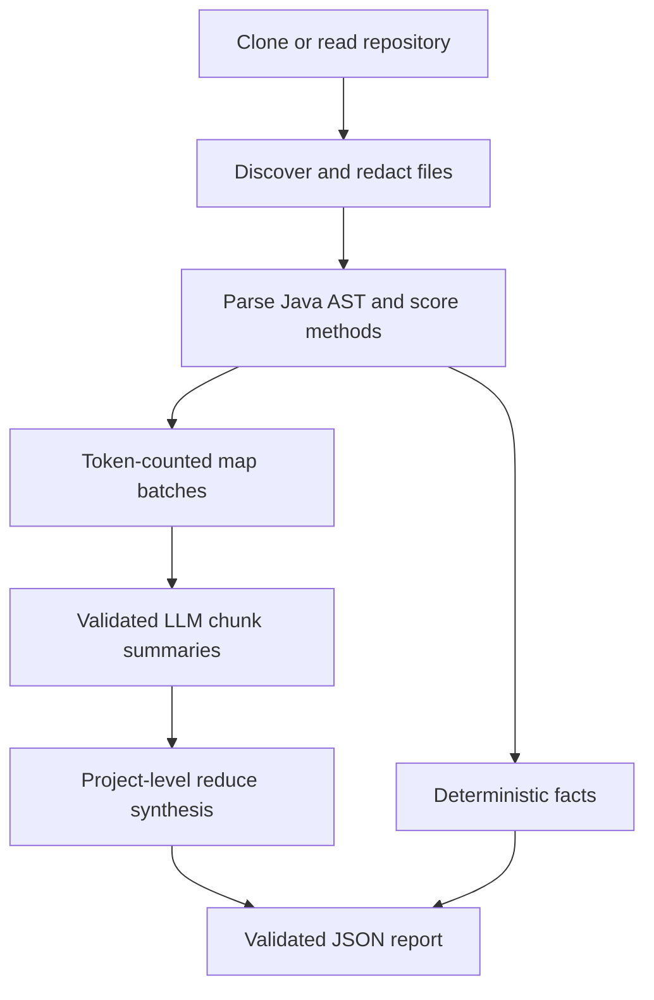

# Codebase Knowledge Extractor

A Python CLI that analyzes a repository with a hybrid of deterministic static analysis and an LLM,
then emits a validated, machine-readable JSON knowledge report. The required target is
[`codejsha/spring-rest-sakila`](https://github.com/codejsha/spring-rest-sakila).

## Why this design

The analyzer does **not** send an entire repository to a model and ask for free-form JSON. Exact facts
are extracted locally, while the LLM is used only where semantic interpretation adds value.



This separation gives four useful properties:

- **Factual integrity:** paths, signatures, line ranges, annotations, and complexity are calculated
  from Tree-sitter syntax trees rather than generated by the model.
- **Bounded cost:** files are ranked for semantic analysis, split with model-aware token counting, and
  packed into batches with explicit prompt and output reserves.
- **Machine readability:** provider-native JSON Schema output and Pydantic validation enforce the
  same schema at every LLM stage and for the final report.
- **Provider flexibility:** the same pipeline can use OpenAI or an open-weight model served by
  Ollama; offline mode validates the deterministic path without LLM calls.
- **Recoverability:** every validated map batch and reduce response is cached immediately with
  repository, source, model, generation, prompt, and schema identity.

## Requirements

- Python 3.11+
- Git
- Either an OpenAI API key or a reachable Ollama server for the final LLM-backed report

The target Spring application itself does not need to compile or connect to MySQL because this tool
performs static analysis.

## Setup

Using `uv`:

```bash
uv sync --extra dev
cp .env.example .env
# Edit .env and set OPENAI_API_KEY.
```

Or with a conventional virtual environment:

```bash
python -m venv .venv
source .venv/bin/activate
pip install -e '.[dev]'
export OPENAI_API_KEY="your-key"
```

The CLI automatically loads `.env` from the working directory without overriding variables already
exported by the shell. Never commit `.env` or an API key. `.env.example` documents the supported
variable names without containing credentials.

## Run the analyzer

The checked-in OpenAI profile contains the repository, model, output, timeout, retry, and cache
settings. With the key in `.env`, the normal run is:

```bash
uv run codebase-analyzer --config configs/sakila-openai.toml
```

TOML profiles use an `[analysis]` table whose keys match the long CLI option names with underscores,
for example `repo_url`, `max_retries`, and `cache_mode`. Secrets do not belong in profiles. Precedence
is explicit CLI option, TOML profile, shell/`.env`, then built-in default, so a one-off override stays
short:

```bash
uv run codebase-analyzer \
  --config configs/sakila-openai.toml \
  --model gpt-5.5
```

The equivalent long-form command remains supported:

```bash
uv run codebase-analyzer \
  --repo-url https://github.com/codejsha/spring-rest-sakila.git \
  --ref main \
  --output output/spring-rest-sakila-analysis.json
```

The default model is `gpt-5.4-mini`, selected for a practical quality/cost balance and native
structured-output support. The model is configurable:

```bash
CODE_ANALYZER_MODEL=gpt-5.5 uv run codebase-analyzer \
  --source-path ../spring-rest-sakila \
  --output output/spring-rest-sakila-analysis.json
```

### Run with Ollama

The Ollama adapter uses Ollama's OpenAI-compatible endpoint, so no second client stack is required.
For a CPU-only Ollama host running `qwen3.5-32k`, use a 32,768-token server context, one parallel
request, and one loaded model. The CLI sends requests sequentially, sets temperature to zero, disables
thinking output, uses a 7,200-second response/read timeout, and validates the same Pydantic schemas as
the OpenAI path.

Configure the Ollama container when it starts:

```text
OLLAMA_CONTEXT_LENGTH=32768
OLLAMA_NUM_PARALLEL=1
OLLAMA_MAX_LOADED_MODELS=1
```

Then run the analyzer locally or connect to a remote Ollama host through an SSH tunnel. Do not
publish Ollama's unauthenticated port directly to the internet.

```bash
# Forward a remote Ollama port to the local machine:
ssh -N -L 11434:localhost:11434 your-user@your-vps

# In a second local terminal:
uv run codebase-analyzer \
  --provider ollama \
  --model qwen3.5-32k \
  --ollama-base-url http://localhost:11434 \
  --max-retries 0 \
  --cache-mode use \
  --repo-url https://github.com/codejsha/spring-rest-sakila.git \
  --ref main \
  --output output/spring-rest-sakila-analysis.json
```

The OpenAI-compatible API cannot set `num_ctx` per request. `qwen3.5-32k` must remain configured
server-side with a 32,768-token context, either through the Ollama server configuration or a derived
model with `PARAMETER num_ctx 32768`. The analyzer still records and enforces its own 24,000-token
input and 8,000-token output ceilings. If a reverse proxy protects Ollama with a bearer token, set
`OLLAMA_API_KEY` rather than placing the credential in the URL or repository.

### Reliability and recovery

Timeouts are explicit HTTPX phase timeouts, not whole-stage deadlines:

| Provider | Read/response | Connect | Write | Pool | Default analyzer retries |
| --- | ---: | ---: | ---: | ---: | ---: |
| Ollama | 7,200s | 10s | 60s | 10s | 0 |
| OpenAI | 180s | 10s | 60s | 10s | 3 |

Use `--ollama-timeout-seconds`, `--openai-timeout-seconds`,
`--connect-timeout-seconds`, and `--max-retries` to override them. SDK retries are disabled so every
analyzer attempt and exponential backoff is visible. Only timeouts, connection failures, HTTP
408/409/429, and 5xx responses are retried. Authentication, authorization, bad requests,
configuration errors, and schema or identifier validation failures stop immediately.

INFO logs identify each map batch, cache decision, request attempt, retry, reduce stage, and atomic
output write. While an uncached request is blocked, a heartbeat is emitted every 60 seconds with the
stage, attempt, elapsed time, and read timeout. Prompt and source contents are never logged.

Validated entries are stored as `.codebase-analyzer-cache/map/<sha256>.json` and
`.codebase-analyzer-cache/reduce/<sha256>.json`. `--cache-mode use` reads and writes,
`refresh` skips reads and atomically replaces entries after fresh validation, and `off` does neither.
Keys cover analyzer/cache versions, repository identity, requested ref, resolved commit, the
deterministic source fingerprint, provider/model/endpoint, material generation settings, complete
prompts and JSON Schemas, and exact ordered inputs/results. Timeouts, retries, and logging do not
invalidate semantic results. Corrupt or semantically invalid entries produce warnings and are treated
as misses; earlier successful batches survive failures and `Ctrl-C`.

To validate repository reading, parsing, token budgeting, and JSON assembly without API calls:

```bash
uv run codebase-analyzer \
  --source-path ../spring-rest-sakila \
  --offline \
  --output output/offline-validation.json
```

Offline mode is intentionally labeled in `generation.mode` and is **not** a replacement for the final
LLM-backed deliverable.

## Processing methodology

### 1. Repository acquisition and discovery

The CLI accepts either `--repo-url` or `--source-path`. Remote repositories are shallow-cloned with
argument-safe `subprocess` calls. The resolved commit SHA is recorded in the report for
reproducibility.

Discovery reads supported source, build, configuration, SQL, and documentation files. It excludes
VCS metadata, generated/build directories, binaries, common secret files, oversized files, and tests
by default. Tests can be included with `--include-tests`. Common password, token, API-key, and signing
key values are redacted before any model call.

### 2. Deterministic Java analysis

Tree-sitter parses every included Java file. The extractor records:

- packages and declared classes;
- exact method or constructor signatures;
- annotations, visibility, and source line ranges;
- approximate cyclomatic complexity.

Complexity is calculated as `1 + decision points`, where decision points include conditionals, loops,
catch clauses, non-default switch labels, ternaries, and `&&`/`||` branches. Ratings are low (1-5),
moderate (6-10), high (11-20), and very high (21+).

“Key methods” are selected with a deterministic, configurable score favoring REST mappings,
controllers, services, custom repositories, authentication/security paths, public APIs, the main
entry point, and higher-complexity behavior. This avoids asking the model to invent or transcribe
signatures.

### 3. Token-aware semantic analysis

The analyzer processes every eligible file locally, then ranks up to `--max-llm-files` for semantic
analysis. Project/build/configuration files receive high priority, followed by behavior-rich Java
files. DTOs and simple entities are represented in static statistics and module structure but receive
lower LLM priority.

Selected files are split only when needed. `tiktoken` counts tokens for the configured model, each
chunk is capped at 8,000 tokens, and chunks are packed into batches capped at 24,000 input tokens with
a 2,500-token prompt reserve. A second ceiling of 12 chunks per batch keeps the structured response
comfortably within the 8,000-token output allowance even when many small files fit in one input
batch. These values live in `AnalyzerConfig` and can be changed without rewriting the pipeline.

The map prompt treats repository text as untrusted data and requests a Pydantic-constrained result.
It receives opaque `chunk_id` and `method_id` values, which are checked after every response. Unknown
or missing chunk identifiers fail the run instead of silently contaminating the report. For Ollama,
the JSON schema is also included in the prompt, following its structured-output reliability guidance;
the prompt reserve accounts for that overhead.

### 4. Project synthesis and JSON assembly

The reduce stage receives deterministic statistics, technology/module detection, complexity results,
and validated map summaries. It returns the project purpose, capabilities, architecture, request flow,
noteworthy aspects, and limitations as a `ProjectSynthesis` object.

The final `AnalysisReport` combines that semantic output with deterministic facts. Pydantic forbids
unknown fields and validates types before the JSON file is written atomically.

## Output structure

| Field | Contents |
| --- | --- |
| `source` | Repository URL, requested ref, resolved commit, and analyzed directory |
| `generation` | Provider, model, mode, timestamp, prompt version, and token strategy |
| `scope` | Discovered/processed/LLM-analyzed file counts, methods, lines, and exclusions |
| `token_budget` | Tokenizer, hard ceilings, chunk/batch counts, and measured input estimates |
| `project` | High-level purpose, capabilities, architecture, request flow, and limitations |
| `technologies` | Build/configuration-evidenced technology list |
| `modules` | Deterministically detected application modules |
| `complexity` | Metric definition, distribution, average, maximum, and top hotspots |
| `key_methods` | Exact signatures and locations plus LLM descriptions and complexity |
| `analyzed_file_summaries` | Validated map-stage summaries with provenance IDs |

## Tests and quality checks

```bash
uv run ruff format .
uv run pytest
uv run ruff check .
uv build
uv run codebase-analyzer --help
```

The tests cover file filtering and secret redaction, Java signature/annotation/complexity extraction,
token chunking and batch limits, provider configuration, retry/heartbeat behavior, cache invalidation
and recovery, atomic writes, CLI failures, and an end-to-end offline pipeline fixture. No static type
checker is configured.

## Important assumptions and limitations

- Static analysis does not execute runtime wiring, database queries, reflection, Lombok-generated
  methods, Spring proxies, or environment-specific configuration.
- The complexity metric is intentionally transparent and reproducible, but it is an approximation;
  a build-integrated tool such as PMD, Checkstyle, or SonarQube could provide additional metrics.
- Semantic analysis prioritizes a configurable subset of files. The report records that scope so this
  is explicit rather than hidden.
- The simple secret redactor reduces accidental disclosure but is not a complete secret-scanning
  solution. A production service should add a dedicated scanner and repository trust controls.
- LLM descriptions can still be imperfect. Deterministic identifiers, schema validation, provenance,
  and explicit limitations reduce risk but do not eliminate the need for human review.
- A vector database is intentionally omitted. The analyzer produces a one-time, full-repository
  report, for which map-reduce provides better coverage and fewer moving parts. For interactive Q&A
  across many repositories or frequent incremental updates, embeddings plus hybrid retrieval would
  be a sensible next extension.
